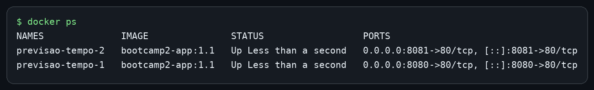

# Previsão do Tempo

Aplicação web responsiva para consultar o clima de qualquer cidade e manter uma lista de cidades favoritas em um banco PostgreSQL real. Este repositório é a evolução da Etapa 01 do Bootcamp II e agora inclui persistência com Supabase e distribuição em uma imagem Docker servida pelo Nginx.

## Autor

Leonardo Jiahao Linchen — Matrícula: 22510052

## Links do projeto

- **Repositório GitHub:** [github.com/leonardojiahao-bit/previsao-do-tempo](https://github.com/leonardojiahao-bit/previsao-do-tempo)
- **Aplicação no GitHub Pages:** [leonardojiahao-bit.github.io/previsao-do-tempo](https://leonardojiahao-bit.github.io/previsao-do-tempo/)
- **Imagem no Docker Hub:** [hub.docker.com/r/leonardojiahao/bootcamp2-app](https://hub.docker.com/r/leonardojiahao/bootcamp2-app)

## Funcionalidades

- Pesquisa de cidades com a API Open-Meteo.
- Temperatura atual, sensação térmica, umidade e velocidade do vento.
- Previsão do tempo para os próximos cinco dias.
- Atalhos para cidades brasileiras.
- Tema claro e escuro.
- Layout responsivo.
- Cadastro de uma cidade como favorita no Supabase.
- Listagem automática dos favoritos ao abrir a página.
- Consulta do clima diretamente a partir de um favorito.
- Exclusão de favoritos.
- Tratamento de carregamento, cidade inexistente, duplicidade e falhas das APIs.

## Persistência de dados

O projeto usa o **Supabase**, que fornece um banco **PostgreSQL** hospedado. O navegador acessa o banco com a biblioteca oficial `@supabase/supabase-js` e uma chave pública (`publishable` ou `anon`). A chave pública pode ficar no frontend; a proteção dos dados é feita pelas políticas de Row Level Security (RLS). Nenhuma chave `service_role` é usada ou exposta.

A tabela `favoritos` possui a seguinte estrutura:

| Campo | Tipo | Finalidade |
|---|---|---|
| `id` | `uuid` | Identificador gerado automaticamente |
| `nome` | `text` | Nome da cidade |
| `estado` | `text` | Estado ou região, quando disponível |
| `pais` | `text` | País da cidade |
| `latitude` | `double precision` | Latitude usada na consulta do clima |
| `longitude` | `double precision` | Longitude usada na consulta do clima |
| `criado_em` | `timestamptz` | Data e hora do cadastro |

A restrição `unique (latitude, longitude)` evita cidades duplicadas. O arquivo [`supabase/schema.sql`](supabase/schema.sql) cria a tabela, ativa RLS e configura as permissões necessárias para **criar, listar e excluir** registros.

> **Limitação conhecida:** para atender ao escopo didático desta etapa, as políticas RLS permitem leitura, inserção e exclusão pelo perfil anônimo. Assim, os favoritos formam uma lista compartilhada. Em produção, o próximo passo seria adicionar autenticação e vincular cada registro ao usuário dono.

Os favoritos sobrevivem ao fechamento do navegador porque são armazenados no PostgreSQL do Supabase. O `localStorage` é usado somente para guardar a preferência de tema e não é utilizado como banco de dados.

## APIs e tecnologias

- HTML5, CSS3 e JavaScript
- [Open-Meteo Geocoding API](https://open-meteo.com/en/docs/geocoding-api)
- [Open-Meteo Weather API](https://open-meteo.com/en/docs)
- Supabase PostgreSQL e `supabase-js`
- Docker
- Nginx Alpine
- GitHub Pages

## Executar localmente

1. Clone o repositório e entre na pasta:

   ```bash
   git clone https://github.com/leonardojiahao-bit/previsao-do-tempo.git
   cd previsao-do-tempo
   ```

2. Sirva os arquivos com um servidor HTTP local, por exemplo:

   ```bash
   python -m http.server 5500
   ```

3. Abra [http://localhost:5500](http://localhost:5500).

## Executar com Docker

Qualquer pessoa com Docker pode baixar e executar a imagem publicada com um único comando:

```bash
docker run -d -p 8080:80 --name previsao-tempo leonardojiahao/bootcamp2-app:1.1
```

Depois, abra [http://localhost:8080](http://localhost:8080).

Para construir a imagem diretamente do código-fonte:

```bash
docker build -t bootcamp2-app .
docker run -d -p 8080:80 --name previsao-tempo bootcamp2-app
```

## Sidequests obrigatórias

### SQ1 — `.dockerignore`

O arquivo [`.dockerignore`](.dockerignore) exclui do contexto de build o histórico do Git, configurações de editores, documentação, scripts do banco e outros arquivos que o Nginx não precisa servir. Isso reduz a quantidade de dados enviada ao Docker, deixa o build mais rápido e evita colocar arquivos desnecessários dentro da imagem.

### SQ2 — Versionamento da imagem

A imagem é publicada com três tags:

- `1.0`: primeira versão funcional com Supabase e Docker.
- `1.1`: melhoria com prevenção de duplicidade, estados de carregamento e persistência do tema.
- `latest`: aponta para a versão estável mais recente, atualmente a `1.1`.

### SQ3 — Overview no Docker Hub

O repositório público no Docker Hub contém a descrição da aplicação, o comando `docker run` pronto para copiar e o link deste repositório GitHub.

### SQ4 — Dois containers e orquestração

Foram executados dois containers simultaneamente, usando as portas `8080` e `8081`:

```bash
docker run -d -p 8080:80 --name previsao-tempo-1 leonardojiahao/bootcamp2-app:1.1
docker run -d -p 8081:80 --name previsao-tempo-2 leonardojiahao/bootcamp2-app:1.1
docker ps
```



Se eu tivesse 100 containers, utilizaria o **Kubernetes** para automatizar a implantação, o monitoramento, o balanceamento de carga e a recuperação de falhas. O Kubernetes organiza as máquinas em um **cluster**, executa os containers dentro de **pods** e utiliza **réplicas** para manter a quantidade desejada de instâncias da aplicação disponível. Se um pod falhar, o controlador cria outro para recuperar o estado esperado.

## Arquivos principais

```text
.
├── index.html
├── style.css
├── script.js
├── config.js
├── favorites.js
├── Dockerfile
├── .dockerignore
├── supabase/
│   └── schema.sql
└── docs/
    └── docker-ps-dois-containers.png
```
